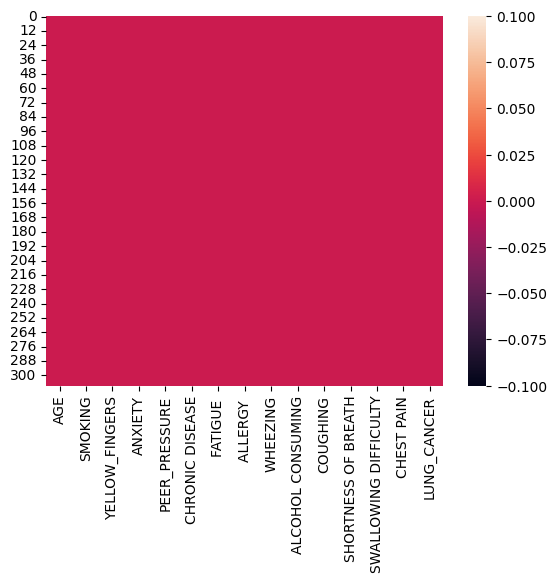
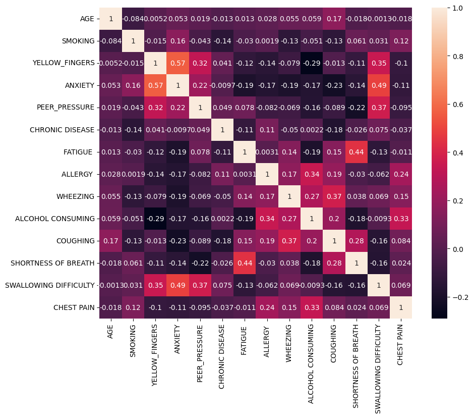
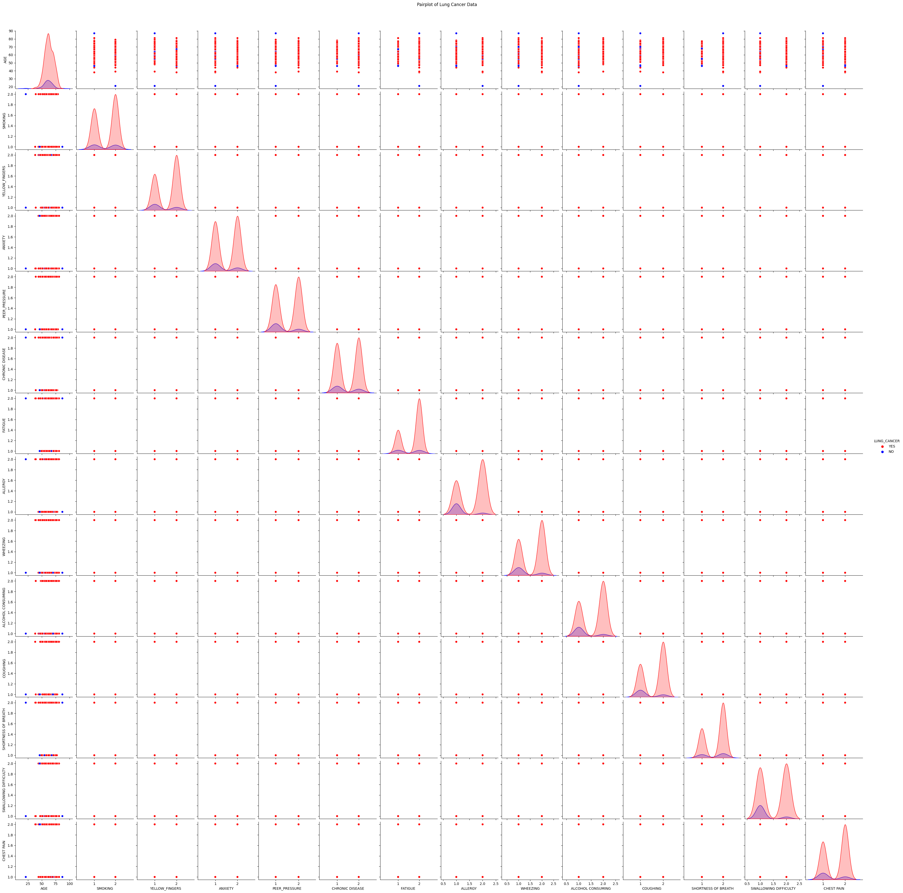
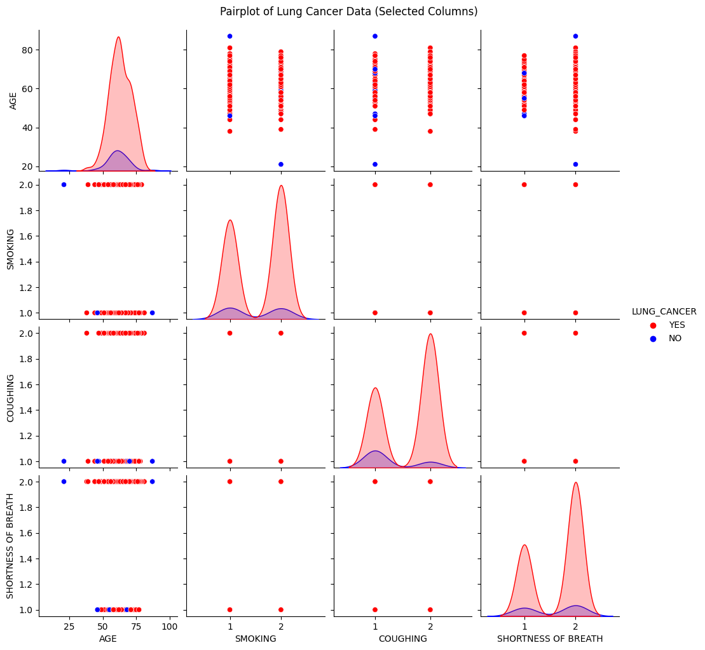
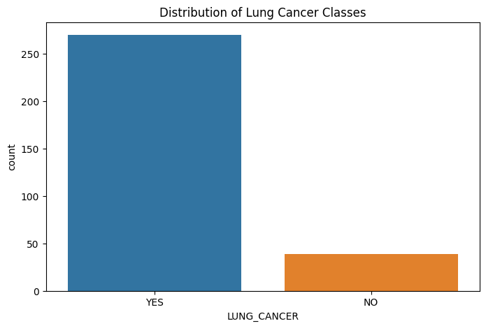
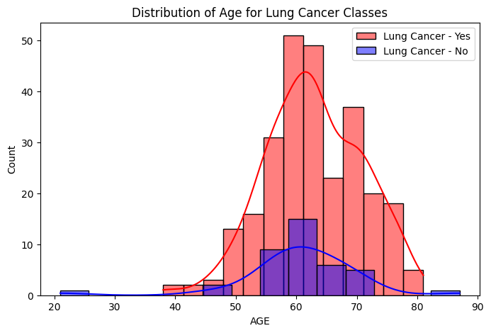
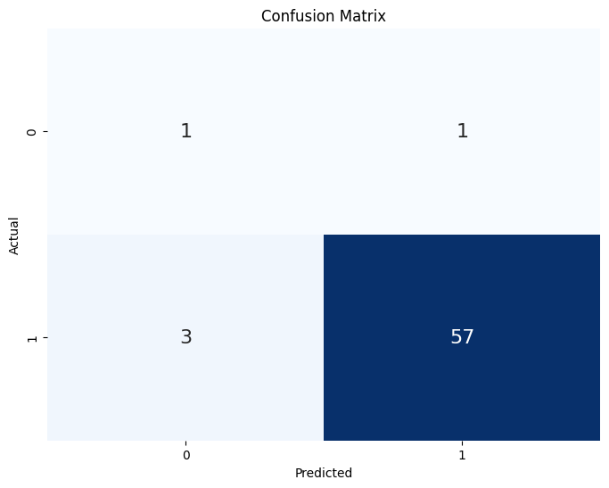

# Laporan Proyek Machine Learning
### Nama : Putri Adinda
### Nim : 211351112
### Kelas : Pagi B

## Domain Proyek

Kanker paru-paru adalah suatu kondisi di mana sel-sel tumbuh secara tidak terkendali di dalam organ paru-paru. Organ ini berfungsi untuk menyebarkan oksigen ke dalam darah saat menghirup napas dan membuang karbondioksida saat menghela napas. Kanker paru terdiri dari dua jenis, yaitu kanker paru primer, kanker paru sekunder. Estimasi harga apartment ini boleh digunakan sebagai patokan bagi semua orang yang ingin mengecek apakah terkena kanker paru-paru atau tidak.

## Business Understanding

Bisa memudahkan untuk mengecek apakah pasien menderita kanker paru-paru atau tidak.

Bagian laporan ini mencakup:

### Problem Statements

- Untuk seseorang yang tidak mempunyai biaya yang cukup untuk cek ke rumah sakit.

### Goals

- Membuat penelitian dalam studi kasus Estimasi Pasien Yang Menderita Kanker Paru-Paru untuk dapat memprediksi apakah pasien menderita kanker paru-paru atau tidak dengan menggunakan metode K-NN.
- Mencari solusi untuk memudahkan orang-orang mengestimasi apakah pasien menderita kanker paru-paru atau tidak.

### Solution statements
- Pengembangan Platform pencarian Estimasi Pasien Yang Menderita Kanker Paru-Paru Berbasis Web, solusi pertama adalah mengembangkan platform pencarian Estimasi Pasien Yang Menderita Kanker Paru-Paru Berbasis Web yang mengintegrasikan data dari Kaggle.com untuk memberikan pengguna akses cepat dan mudah ke informasi tentang Estimasi Pasien Yang Menderita Kanker Paru-Paru. Platform ini akan menyediakan antarmuka pengguna yang ramah. 
- Model yang dihasilkan dari datasets itu menggunakan metode K-NN.

## Data Understanding
Dataset yang saya gunakan berasal dari Kaggle. Dataset ini mengandung 309 baris dan 16 columns.<br> 

[LUNG CANCER](https://www.kaggle.com/datasets/mysarahmadbhat/lung-cancer).


### Variabel-variabel pada Nutrition Facts for McDonald's Menu adalah sebagai berikut:
- GENDER      : Jenis Kelamin. [Tipe data: Object, Contoh: Male, Female]
- AGE          : Usia. [Tipe data: Integer, Contoh: 69, 74]
- SMOKING      : Merokok. [Tipe data: Integer, Contoh: YES=2, NO=1]
- YELLOW_FINGERS    : Jari Kuning. [Tipe data: Integer, Contoh: YES=2, NO=1]
- ANXIETY      : Kecemasan. [Tipe data: Integer, Contoh: YES=2, NO=1]
- PEER_PRESSURE      : Tekanan. [Tipe data: Integer, Contoh: YES=2, NO=1]
- CHRONIC DISEASE    : Penyakit Kronis. [Tipe data: Integer, Contoh: YES=2, NO=1]
- FATIGUE      : Kelelahan. [Tipe data: Integer, Contoh: YES=2, NO=1]
- ALLERGY      : Alergi. [Tipe data: Integer, Contoh: YES=2, NO=1]
- WHEEZING      : Mengi. [Tipe data: Integer, Contoh: YES=2, NO=1]
- ALCOHOL CONSUMING    : Konsumsi Alkohol. [Tipe data: Integer, Contoh: YES=2, NO=1]
- COUGHING      : Batuk. [Tipe data: Integer, Contoh: YES=2, NO=1]
- SHORTNESS OF BREATH    : Sesak Napas. [Tipe data: Integer, Contoh: YES=2, NO=1]
- SWALLOWING DIFFICULTY    : Kesulita Menelan. [Tipe data: Integer, Contoh: YES=2, NO=1]
- CHEST PAIN      : Nyeri Dada. [Tipe data: Integer, Contoh: YES=2, NO=1]
- LUNG_CANCER      :Kanker Paru-Paru. [Tipe data: Object, Contoh: YES, NO]

## Data Preparation
### Data Collection
Untuk data collection ini, saya mendapatkan dataset yang nantinya digunakan dari website kaggle dengan nama dataset LUNG CANCER. Datasetnya bisa di download pada link diatas.

### Data Discovery And Profiling
Untuk bagian ini, saya akan menggunakan teknik EDA. <br>
Pertama kita mengimport semua library yang dibutuhkan, 
``` bash
import pandas as pd
import numpy as np
import seaborn as sns
import matplotlib.pyplot as plt
from sklearn.model_selection import train_test_split
from sklearn.preprocessing import StandardScaler
from sklearn.neighbors import KNeighborsClassifier
from sklearn.metrics import accuracy_score, classification_report, confusion_matrix
```

Karena kita menggunakan google colab untuk mengerjakannya maka kita akan import files juga,
``` bash
from google.colab import files
```

Lalu mengupload token kaggle agar nanti bisa mendownload sebuah datasets dari kaggle melalui google colab
``` bash
file.upload()
```
Setelah mengupload filenya, maka akan lanjut dengan membuat sebuah folder untuk menyimpan file kaggle.json yang sudah diupload tadi, 
``` bash
!mkdir -p ~/.kaggle
!cp kaggle.json ~/.kaggle/
!chmod 600 ~/.kaggle/kaggle.json
!ls ~/.kaggle
```
Lalu mari kita download datasets nya, 
``` bash
!kaggle datasets download -d mysarahmadbhat/lung-cancer
```
Selanjutnya kita harus extract file yang tadi telah didownload
``` bash
!mkdir lung-cancer
!unzip lung-cancer.zip -d lung-cancer
!ls lung-cancer
```
Lanjut dengan memasukkan file csv yang telah diextract pada sebuah variable,
``` bash
df = pd.read_csv("/content/lung-cancer/survey lung cancer.csv")
```
Untuk menampilkan baris pertama dari baris ke-n pada dataset.
``` bash
df.head()
```
Untuk menampilkan statistik deskriptif dari data frame atau series.
``` bash
df.describe()
```
Untuk melihat mengenai type data dari masing masing kolom kita bisa menggunakan property info,
``` bash
df.info()
```
Selanjutnya kita akan memeriksa apakah datasetsnya terdapat baris yang kosong atau null dengan menggunakan seaborn,
```  bash
sns.heatmap(df.isnull())
```
 <br>

Mari kita lanjut dengan data exploration kita,
``` bash
plt.figure(figsize=(10,8))
sns.heatmap(df.corr(), annot=True)
```


Selanjutnya mari kita lihat Pairplot Data Kanker Paru,
``` bash
sns.pairplot(df, hue='LUNG_CANCER', palette={'YES': 'red', 'NO': 'blue'})
plt.suptitle('Pairplot of Lung Cancer Data', y=1.02)
plt.show()
```


Selanjutnya kita lihat Pairplot Data Kanker Paru dari (Kolom Terpilih),
``` bash
# Pilih 4 kolom yang ingin ditampilkan dalam pair plot
selected_columns = ['AGE', 'SMOKING', 'COUGHING', 'SHORTNESS OF BREATH', 'LUNG_CANCER']
subset_df = df[selected_columns]

# Plot pair plot untuk 4 kolom
sns.pairplot(subset_df, hue='LUNG_CANCER', palette={'YES': 'red', 'NO': 'blue'})
plt.suptitle('Pairplot of Lung Cancer Data (Selected Columns)', y=1.02)
plt.show()
```


Selanjutnya kita lihat Distribusi Kelas Kanker Paru,
``` bash
# Countplot untuk distribusi kelas
plt.figure(figsize=(8, 5))
sns.countplot(x='LUNG_CANCER', data=df)
plt.title('Distribution of Lung Cancer Classes')
plt.show()
```


Selanjuta kita lihat Sebaran Usia Kelas Kanker Paru Berdasarkan Usia,
``` bash
# Dustribusi fitur (AGE)
plt.figure(figsize=(8, 5))
sns.histplot(df[df['LUNG_CANCER'] == 'YES']['AGE'], color='red', label='Lung Cancer - Yes', kde=True)
sns.histplot(df[df['LUNG_CANCER'] == 'NO']['AGE'], color='blue', label='Lung Cancer - No', kde=True)
plt.title('Distribution of Age for Lung Cancer Classes')
plt.legend()
plt.show()
```


Mari lanjut dengan modeling.

## Modeling
sebelumnya mari kita import library yang nanti akan digunakan,
``` bash
from sklearn.model_selection import train_test_split
from sklearn.preprocessing import StandardScaler
from sklearn.neighbors import KNeighborsClassifier
from sklearn.metrics import accuracy_score, classification_report, confusion_matrix
```
Langkah pertama adalah memasukkan kolom-kolom fitur yang ada di datasets dan juga kolom targetnya,
 ``` bash
features = df[['AGE', 'SMOKING', 'YELLOW_FINGERS', 'ANXIETY', 'PEER_PRESSURE',
               'COUGHING', 'SHORTNESS OF BREATH', 'SWALLOWING DIFFICULTY', 'CHEST PAIN', 'CHRONIC DISEASE', 'WHEEZING']]
target = df['LUNG_CANCER']
 ```
Selanjutnya kita akan menentukan berapa persen dari datasets yang akan digunakan untuk test dan untuk train, disini kita gunakan 20% untuk test dan sisanya untuk training alias 80%
``` bash
X_train, X_test, y_train, y_test = train_test_split(features, target, test_size=0.2, random_state=42)
```
Mari kita lanjut dengan membuat model Linear Regressionnya
``` bash
k = 3
knn_model = KNeighborsClassifier(n_neighbors=k)
```
Mari lanjut, memasukkan x_train dan y_train pada model dan memasukkan value predict pada y_pred,
``` bash
y_pred = knn_model.predict(X_test_scaled)
print("Test set predictions:\n {}".format(y_pred))
print(y_pred.shape)
```
Sekarang kita bisa melihat score dari model kita,
``` bash
print("Accuracy on test set: {:.4f}".format(accuracy_score(y_test, knn_model.predict(scaler.transform(X_test)))))
print("Accuracy: {:.2f}%".format(accuracy_score(y_test, y_pred, normalize=True) * 100))
```
Score model nya yaitu 93.55%, selanjutnya mari kita test menggunakan sebuah array value.
``` bash
# Data baru yang akan diprediksi
new_data_1 = pd.DataFrame([[59, 1, 1, 1, 2, 2, 2, 1, 2, 1, 2]], columns=['AGE', 'SMOKING', 'YELLOW_FINGERS', 'ANXIETY', 'PEER_PRESSURE',
                                                                       'COUGHING', 'SHORTNESS OF BREATH', 'SWALLOWING DIFFICULTY', 'CHEST PAIN', 'CHRONIC DISEASE', 'WHEEZING'])
new_data_2 = pd.DataFrame([[30, 1, 1, 1, 2, 1, 2, 1, 1, 1, 1]], columns=['AGE', 'SMOKING', 'YELLOW_FINGERS', 'ANXIETY', 'PEER_PRESSURE',
                                                                       'COUGHING', 'SHORTNESS OF BREATH', 'SWALLOWING DIFFICULTY', 'CHEST PAIN', 'CHRONIC DISEASE', 'WHEEZING'])

# Normalisasi data baru menggunakan mean dan std dari data latih
new_data_1_scaled = scaler.transform(new_data_1)
new_data_2_scaled = scaler.transform(new_data_2)

# Prediksi label untuk data baru
prediction_1 = knn_model.predict(new_data_1_scaled)
prediction_2 = knn_model.predict(new_data_2_scaled)


# Tampilkan hasil prediksi
print("Apakah Pasien Terkena Penyakit Kanker Paru-Paru?:", prediction_1[0])
print("Apakah Pasien Terkena Penyakit Kanker Paru-Paru?:", prediction_2[0])
```

Sekarang modelnya sudah selesai, mari kita export sebagai file sav agar nanti bisa kita gunakan pada project web streamlit kita.
``` bash
import pickle

filename = 'knn-paru-paru.sav'
pickle.dump(knn_model, open(filename, 'wb'))
```


## Evaluation
Disini saya menggunakan Confusion Matrix sebagai metrik evaluasi.

``` bash
# Confusion Matrix
cm = confusion_matrix(y_test, y_pred)

# Visualisasi Confusion Matrix dengan Seaborn
plt.figure(figsize=(8, 6))
sns.heatmap(cm, annot=True, fmt='d', cmap='Blues', annot_kws={"size": 16}, cbar=False)
plt.title('Confusion Matrix')
plt.xlabel('Predicted')
plt.ylabel('Actual')
plt.show()
```


Penjelasan confusion matrix:

TN (True Negative): Jumlah sampel yang benar-benar negatif dan telah diprediksi dengan benar sebagai negatif = 1
FP (False Positive): Jumlah sampel yang sebenarnya negatif tetapi telah salah diprediksi sebagai positif = 1
FN (False Negative): Jumlah sampel yang sebenarnya positif tetapi telah salah diprediksi sebagai negatif = 3
TP (True Positive): Jumlah sampel yang benar-benar positif dan telah diprediksi dengan benar sebagai positif = 57

## Deployment

[Estimasi Protein Menu McDonald](https://app-estimasi-protein-giutfqlbvjevjdp2ux6bnw.streamlit.app/). 
